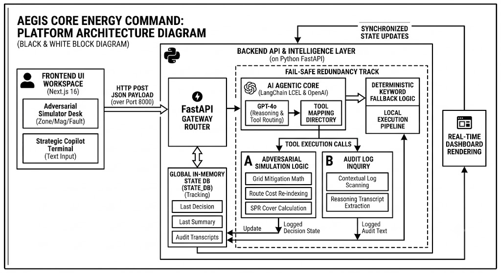

# Aegis Core: Autonomous Energy Command 🛡️⚡

Aegis Core is an elite, light-industrial **Adversarial Simulation Platform** designed to model, stress-test, and secure macroeconomic energy supply chains against unpredictable geopolitical disruptions and cyber-physical shocks.

Traditional energy command frameworks rely on passive dashboards. **Aegis Core introduces an Autonomous Agentic Workflow**, combining fine-grained control parameters with an AI Strategic Copilot capable of both orchestrating real-time macro shocks and explaining complex multi-agent routing decisions.

---

## 🚀 The Core Problem Statement

Modern energy distribution networks are heavily dependent on volatile maritime transit corridors (e.g., the Strait of Hormuz, the Red Sea) and vulnerable to targeted digital/kinetic infrastructure asset sabotage. When a disruption strikes, traditional systems fail to calculate the downstream impacts or alternative routing parameters in real time.

**Aegis Core solves this by bridging:**
1. **Adversarial Chaos Engineering:** Allowing operators to inject localized disruption vectors and cyber-physical shocks directly into the grid engine.
2. **Agentic Context Reasoning:** A unified natural language terminal that acts as both an operational copilot (triggering actions via text) and an audit analyst (unpacking linear programming decision transcripts for human operators).

---

## 🏗️ Platform Architecture


The diagram above shows the full request/response lifecycle: the **Frontend UI Workspace** sends an HTTP POST JSON payload to the **FastAPI Gateway Router**, which hands off to the **AI Agentic Core** (LangChain LCEL + OpenAI GPT-4o) for reasoning and tool routing. Depending on the request, the core dispatches to either the **Adversarial Simulation Logic** tool (grid mitigation math, route cost re-indexing, SPR cover calculation) or the **Audit Log Inquiry** tool (contextual log scanning, reasoning transcript extraction). A **Fail-Safe Redundancy Track** with deterministic keyword-matching fallback logic and a local execution pipeline ensures the platform never freezes or crashes if the external LLM API times out. All decisions and audit transcripts are persisted to a **Global In-Memory State DB**, which synchronizes state back to the frontend for **real-time dashboard rendering**.

---

## 🛠️ Architecture & Tech Stack

The platform is split into two cleanly decoupled layers engineered for high throughput and low-latency state updates.



### Frontend Workspace (`/frontend`)
* **Framework:** Next.js 16 (App Router) powered by **Turbopack** for optimized incremental compilation.
* **Styling:** Tailwind CSS v4 featuring a high-contrast industrial light slate aesthetic (`#f1f5f9`) balanced against deep slate/obsidian UI modules.
* **Components & Processing:** Integrated with `lucide-react` for system iconography and `react-markdown` to compile complex textual agent tool loops into clean, readable bullet points.

### Backend Intelligence Layer (`/backend`)
* **Gateway API:** Python FastAPI executing asynchronous validation routines.
* **Orchestration Core:** Built on **LangChain's Expression Language (LCEL)** using OpenAI's `gpt-4o` with advanced function tool binding capabilities.
* **Fail-Safe Reliability Architecture:** The backend features a deterministic keyword-matching fallback system. If an external API timeout or account credit/quota limit exception occurs, the platform automatically switches to local calculations, ensuring the presentation **never freezes or crashes live**.

---

## ⚙️ Setup & Deployment Guide

### Prerequisites
* Python 3.10+
* Node.js 18+
* An OpenAI API Key (Optional due to local fail-safe architecture)

### 1. Backend Initialization
Navigate to your backend workspace, spin up your virtual environment, and install core dependencies:

```bash
cd backend
python -m venv venv
source venv/bin/activate  # On Windows use: .\venv\Scripts\activate
pip install fastapi uvicorn pydantic langchain langchain-openai openai python-dotenv
```

Create a `.env` file in the `/backend` directory:

```
OPENAI_API_KEY=your_sk_project_key_here
```

Launch the hot-reloading development server:

```bash
uvicorn main:app --reload
```

### 2. Frontend Workspace Setup
Open a separate terminal window, head to the frontend workspace directory, and install the package trees:

```bash
cd frontend
npm install react-markdown lucide-react
```

> **Note:** If npm throws a React version package resolution conflict due to external tracking libraries, use: `npm install react-markdown --legacy-peer-deps`

Boot the user interface environment:

```bash
npm run dev
```

Open `http://localhost:3000` inside your web browser to access the control room panel dashboard.

---

## 🖥️ Operational Walkthrough for Presentations

When showcasing Aegis Core to judges or recording a demonstration, follow this operational track:

1. **Manual Shock Calibration:** Adjust the Disruption Corridor dropdown to `Red Sea (Suez Corridor)`, set the slider magnitude to `75%`, toggle `Compounding Cyber Faults`, and click `Run Strategic Immunization Model`. Note the direct state shift inside the terminal log framework box.

2. **Natural Language Execution:** Go down to the Aegis Strategic Copilot input block. Type: `Simulate a 60% pipeline failure in the Strait of Hormuz` and click `Execute`. The system automatically routes the text parameter through the LLM tool array, modifying layout parameters dynamically.

3. **Reasoning Audit:** Query the agent by typing `Why did the core choose to route traffic via Paradip Port?`. The copilot will tap into the audit log tool array and immediately return a scannable Markdown breakdown detailing insurance premiums and risk metrics.

---

## 💡 Final Tip before Push

Make sure to add a `.gitignore` file to your root directory containing:

```
venv/
node_modules/
.env
```
